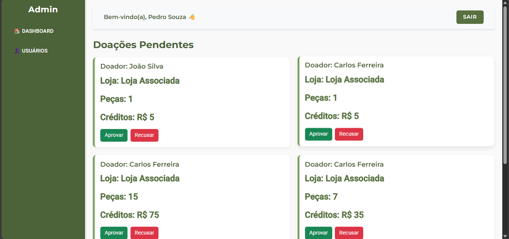
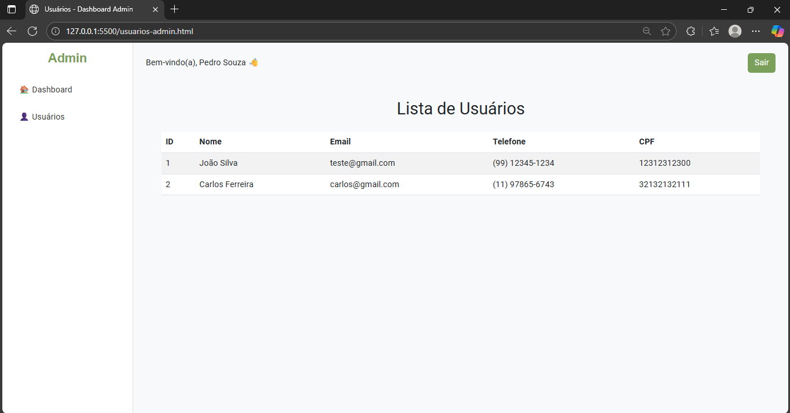
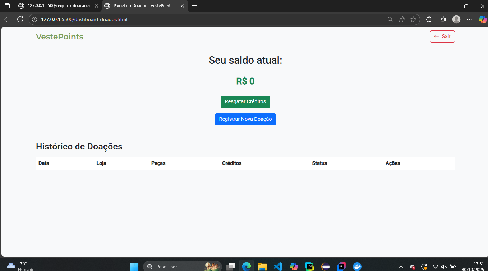
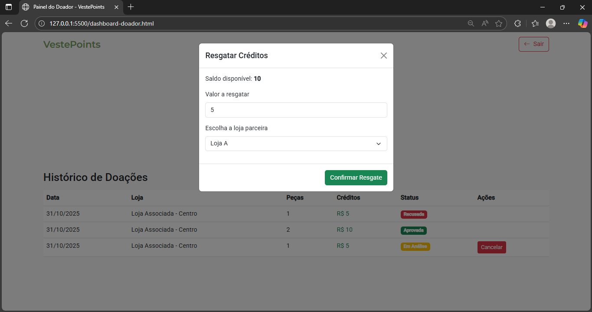

VestePoints - Sistema de Doações com Recompensas

VestePoints é um sistema de gerenciamento de doações de roupas que recompensa os doadores com créditos para serem usados em lojas parceiras. O usuário cadastra-se como doador, registra suas doações informando tipo e quantidade de peças, e, após validação de um administrador associado à loja, recebe créditos proporcionais. Esses créditos poderão futuramente ser utilizados como descontos na loja em que doou. Este projeto é um MVP acadêmico, focado em demonstrar o funcionamento da lógica de doação e acompanhamento de créditos.

O backend foi desenvolvido em Java 21 com Spring Boot 3.5.7, utilizando MySQL como banco de dados, com container Docker para facilitar a execução. O Maven foi usado como gerenciador de dependências, incluindo Spring Data JPA, Spring Web, Spring Validation e Lombok. O frontend é uma aplicação estática com HTML5, CSS3, Bootstrap 5.3, JavaScript e Bootstrap Icons, responsável por apresentar o dashboard do doador e registrar doações.

O banco de dados já é inicializado com uma loja teste chamada "Loja Associada", para que o sistema funcione sem necessidade de configuração manual. Para executar o projeto, o usuário deve ter Java 21 e Docker instalados, rodar docker-compose up -d na raiz do projeto para iniciar o banco, e depois executar a aplicação Spring Boot. Em seguida, basta abrir o arquivo index.html do frontend e iniciar com Go Live ou abrir no navegador.

O sistema inclui controle de status das doações (em análise, aprovado ou recusado), histórico de doações para cada doador e geração de cupons de resgate simulados. Foram adicionadas 7 imagens para ilustrar a interface e funcionamento. Este projeto é voltado para fins acadêmicos e demonstra conceitos de economia circular, incentivo à doação e interação entre usuários, administradores e lojas parceiras.

## Capturas de Tela

### 🏠 Homepage

### 🧑‍💼 Dashboard do Administrador 

### 🧑‍💼 Dashboard do Administrador 

### 👤 Dashboard do Doador

### 💳 Resgate de Créditos do Doador

